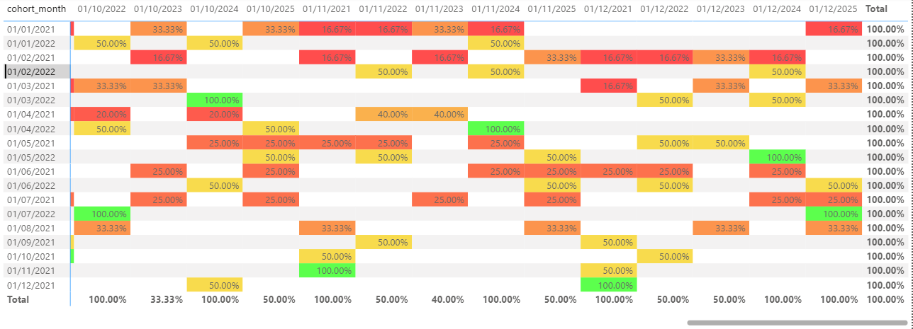
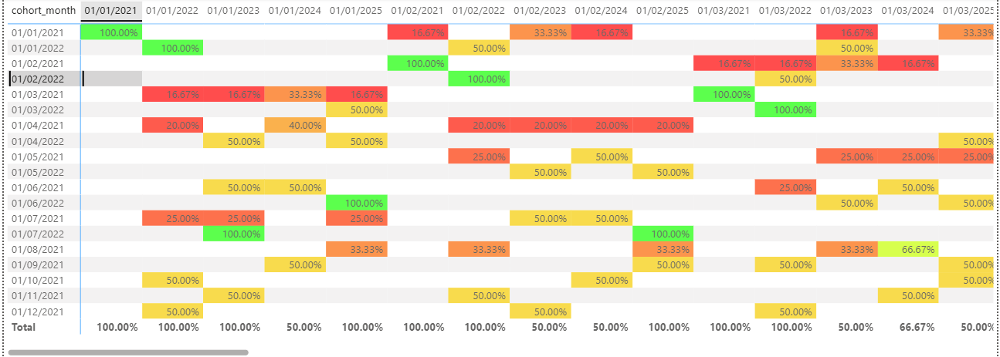

# Project 3 – Customer Retention & Churn Analysis (PostgreSQL + Power BI)

Este proyecto analiza la **retención de clientes y churn** usando la base de datos **Chinook** en PostgreSQL, y visualiza los resultados con **Power BI**.

---

## Objetivo
- Medir la **retención de clientes** por cohorte mensual (mes de primera compra).
- Calcular la **tasa de churn** (clientes que no regresan).
- Construir un **heatmap de cohortes** en Power BI para visualizar cómo los clientes regresan (o no) a lo largo del tiempo.

---

## Tecnologías usadas
- **PostgreSQL 17**
- **Power BI Desktop**
- **SQL (CTEs, agregaciones, funciones de fecha)**
  
---

## Estructura
- `sql/01_date_range.sql` → rango de fechas disponible en `invoice`.
- `sql/02_activity_per_month.sql` → clientes activos por mes.
- `sql/03_retention.sql` → construcción de cohortes y compras mensuales.
- `sql/04_churn.sql` → tabla final con métricas de retención y churn.
- `powerbi/retention_churn.pbix` → reporte con matriz de cohortes (heatmap).

---

## Metodología
1. **Cohortes iniciales**: se identificó el mes de primera compra de cada cliente (`cohort_month`).  
2. **Compras posteriores**: se registraron las compras en meses siguientes (`purchase_month`).  
3. **Retención y churn**:  
   - `retención % = clientes_recurrentes / clientes_iniciales * 100`  
   - `churn % = 100 - retención %`

---

## Resultados
Se construyó una matriz de cohortes en Power BI con formato condicional (heatmap):

- Verde → Alta retención (ej. 100%).  
- Amarillo → Retención media (ej. 33%).  
- Rojo → Baja retención (ej. 16%).  
- Blanco → No aplica (meses anteriores a que exista el cohorte).  

--> Ejemplo de retención en cohortes:
- Cohorte de enero 2021: 100% en mes inicial, 33.3% al mes siguiente, 16.7% en los meses posteriores.  
- La retención cae rápido, lo que refleja **churn alto** en los primeros meses.  

---

## Captura del dashboard

---

##  Próximos pasos
- Conectar este reporte a Power BI Service para monitorear clientes en tiempo real.  
- Integrar cohortes con Python/Pandas para análisis complementarios.  
- Calcular KPIs de negocio (DAU/WAU/MAU).